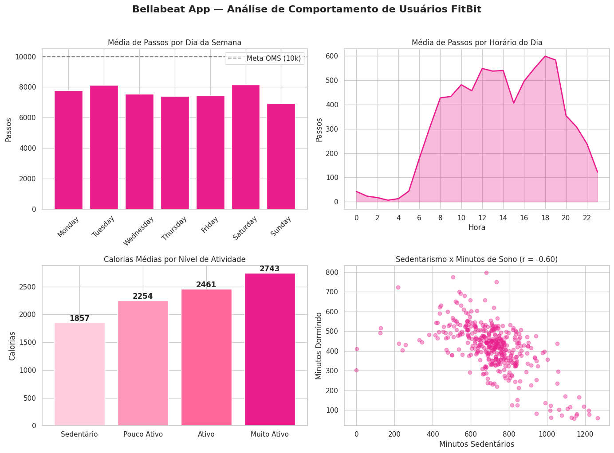

# Bellabeat App: Análise de Comportamento de Usuários Fitness

Capstone Project do curso **Google Data Analytics Certificate**

## Sobre o Projeto

Análise de dados de uso de dispositivos fitness de usuários FitBit para identificar
tendências de comportamento e aplicá-las ao Bellabeat App, orientando a estratégia
de marketing da empresa para mulheres interessadas em saúde e bem-estar.

## Ferramentas Utilizadas

- Python (Pandas, Matplotlib, Seaborn)
- Jupyter Notebook / Kaggle
- Dataset: FitBit Fitness Tracker Data (Kaggle, licença CC0)

## Estrutura da Análise

Seguindo o processo de análise de dados em 6 etapas:

| Etapa | Descrição |
|---|---|
| Ask | Definição da tarefa de negócio |
| Prepare | Coleta e avaliação dos dados (ROCCC) |
| Process | Limpeza e transformação |
| Analyze | Análise e descoberta de insights |
| Share | Visualizações |
| Act | Recomendações finais |

## Principais Insights

- Média de 7.638 passos/dia — abaixo dos 10.000 recomendados pela OMS
- ~17 horas sedentárias por dia
- Correlação de -0.60 entre sedentarismo e qualidade do sono
- Domingo é o dia mais sedentário (6.933 passos)
- Picos de atividade às 12h e entre 17h–19h
- Usuários muito ativos queimam 47% mais calorias que sedentários

## Visualizações

## Recomendações para o Bellabeat App

1. **Campanha "Mova-se para Dormir Melhor"** — conectar funcionalidades de atividade e sono
2. **Notificações Inteligentes** — domingo e horários de pico (12h e 17h–19h)
3. **Gamificação por Nível de Atividade** — motivar usuárias com progressão de calorias

## Limitações

- Amostra pequena (33 usuários) — resultados não generalizáveis
- Sem dados demográficos — não confirmamos se são mulheres
- Dados de 2016 — hábitos podem ter mudado

## Notebook Completo

[Ver no Kaggle](https://www.kaggle.com/code/vivikari/bellabeat-app-an-lise-de-comportamento)